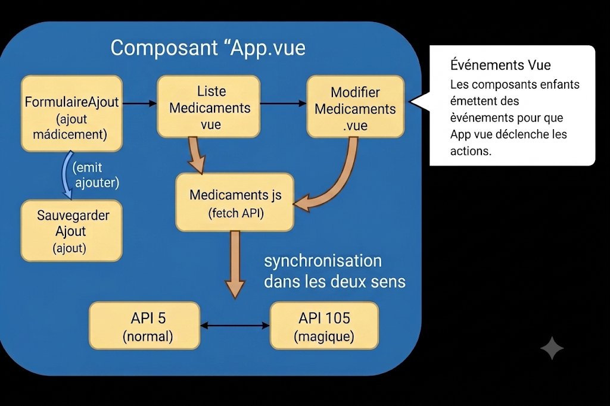

# MiniPharma

MiniPharma est une petite application web qui permet de gérer des médicaments.

Le but du projet était de créer une interface simple pour ajouter, modifier et supprimer des médicaments, tout en utilisant une API.

## Fonctionnalités

Avec l’application, on peut :

- Ajouter un médicament avec un nom, une forme, une quantité et une image
- Supprimer un médicament
- Modifier un médicament
- Changer la quantité avec des boutons + et -
- Rechercher un médicament
- Activer un mode “magique” qui change les données utilisées

## Comment ça fonctionne

L’application fonctionne avec Vue.js.

Il y a un composant principal (App.vue) qui gère les données.

Ensuite, d’autres composants servent à :

- Ajouter un médicament
- Afficher la liste des médicaments
- Modifier un médicament

Quand on clique sur un bouton, un événement est envoyé à App.vue, qui appelle ensuite une fonction pour modifier les données.

## API

L’application utilise une API externe pour stocker les médicaments.

Il y a deux APIs :

- une normale (id 5)
- une magique (id 105)

Toutes les actions (ajout, modification, suppression) sont faites sur les deux APIs pour qu’elles restent synchronisées.

## Images

Pour les images, l’API ne les gère pas bien lors des modifications.

Du coup, les images sont sauvegardées en local avec localStorage pour éviter qu’elles disparaissent.

## Lancer le projet

Installer les dépendances :

npm install

Puis lancer le projet :

npm run dev

## Architecture de l’application

Voici un schéma représentant l’architecture de l’application.

Il montre comment les différents composants sont organisés et comment ils communiquent entre eux.

Le composant principal est App.vue, qui gère les données et les actions.

Les autres composants (FormulaireAjout, ListeMedicaments, ModifierMedicaments) envoient des événements à App.vue pour déclencher des actions comme ajouter, modifier ou supprimer un médicament.

Les appels API sont gérés dans le fichier Medicaments.js, qui utilise fetch pour communiquer avec les deux APIs (5 et 105).

La synchronisation est faite dans les deux sens pour que les données soient toujours identiques.

